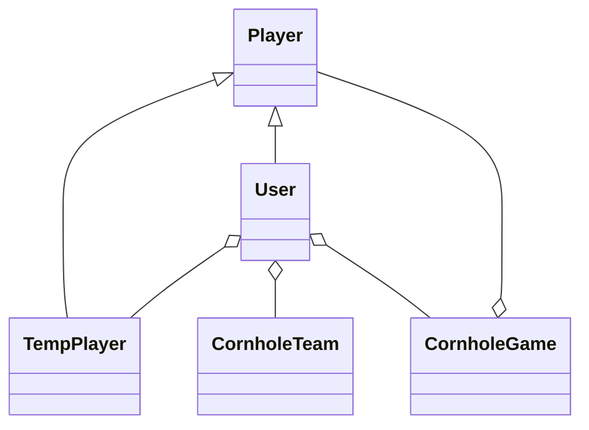

# cornhole-tracker

An application that can be used to track cornhole stats over time.

# Features

- A randomizer can choose which team goes first, or one can be set as the first team to go.
- 2 or 4 players can play each game
  - If there are 4 players The user can choose what side each person is on at the boards
  - If there are 2 players, each round goes back and forth between those 2
- The team sides in the UI can be switched at any time during the game, so that if the phone recording scores is passed off, it can make sense to the other person.

# Architecture

## State Architecture

A primary goal of this application is to enable offline usage. This will have implications in how the data and software is built. For example, if a player wants to create a new game, they still need to be able to add their friends and have that link up to their actual profiles later when they get internet again.

- Offline player data syncing: Players need to be able to add another person by name while offline. There seems to be two approaches that could make this happen
  - Have the user put in their username exactly so it will match later
  - Let the user put in anything they like for the name, and before the game can be submitted, make sure they match the user to an existing person with some kind of UI addition confirmation dialog.
  - Maybe both of the above. If the user puts the correct userName in, then match it automatically. Otherwise, have them enter it if they want to upload the game to the cloud to calculate stats for them.

## Data Architecture

The data architecture below is based upon using a document-based DB.

- `user`: A standard user of the software. This object will contain links to games they have played, but only the ones they want stats calculated on their profile for. If they want to see all games, even ones they haven't accepted, that will be a different query. This will inherit from a more general person type.
  - `currentTeamsIncludingUser` will act in a kind of special way. A solo team will always be an option and shown to the user so they can change their color when they like. The user can archive teams here so it doesn't show up as an option to them when creating new games.
  - `currentTeamsNotIncludingUser`: Contains teams that the user has created that don't include themself. These will come up as an option when creating a new game.
  - `tempPlayers` are players that the user has created that aren't linked to an actual user in the database.
  - `profileIsPublic`: False by default, but if set to true, then other people will see their stats and that will be pulled in when calculating them for games that other people create.
  - `isArchived` if this is true, then the account is essentially deleted, but for scoring purposes in other people's games, the document will stay. Also, if set to true, the username is no longer in use, and can be used by someone else again.

```json
{
  "id": "someGuid",
  "name": "Rebecca Smith", // Could be optional, as the username could be the default to display
  "userName": "uniqueUsername", // Has to remain unique and unchanged, just in case someone hasn't linked this account offline for some games
  "auth": {
    // This object is used for login purposes
    "googleId": "someGuid", // Optional
    "githubId": "someGuid" // Optional
  },
  "approvedGames": ["cornholeGameId1", "cornholdGameId2"],
  "currentTeamsIncludingUser": [
    "soloTeamId",
    "otherPartnerTeamId",
    "anotherPartnerTeamId"
  ],
  "currentTeamsNotIncludingUser": ["otherTeamId1", "otherTeamId2"],
  "tempPlayers": ["tempPlayerId1", "tempPlayerId2"],
  "profileIsPublic": false,
  "isArchived": false
}
```

- `cornholeGame`: Defined as the session where 2 or 4 players play on 2 teams. If 2 players are playing, then the rounds are always with the same 2 people. If 4 people are playing, then the rounds go back and forth between 2 opposing players on each team. Whoever reaches 21 points first, wins. The points to win are variable though and can change per game. A game does not have to be finished for it to be registered here, but a game does have to be finished to calculate stats (Otherwise, if a game ends with an uneven number of rounds, then the stats will be incorrect for the players).
  - `owner`: The user that created the game. Only this user can permenently delete the game, and log scores for it.

```json
{
  "id": "someGuid",
  "teams": ["teamId1", "teamId2"],
  "gameIsComplete": false,
  "rounds": [
    // The order of these rounds is important
    {
      "playerId1": 10,
      "playerId2": 9
    },
    {
      "playerId3": 4,
      "playerId4": 2
    },
    {
      "playerId1": 6,
      "playerId2": 8
    }
  ],
  "playerPositioning": {
    "is4PlayerGame": true,
    "board1Players": [
      // Array only exists if it is a 4 player game
      "playerId1",
      "playerId2"
    ],
    "board2Players": [
      // Array only exists if it is a 4 player game
      "playerId3",
      "playerId4"
    ]
  },
  "owner": "ownerId"
}
```

- `cornholeTeam`: Defined as a grouping of players that may play over a span of `cornholeGame`s, or possibly for only one `cornholeGame`. It is supposed to only contain information on the players and possibly the color of the team, but no stats. Only the `owner` (the creator of the team) and the team members themselves can change the name of the team or the color.
  - `players` Contains the information on the players for the team. This is where temporary players can be entered if internet is not available or the new player doesn't have an account.
  - `isArchived` means that the team will not be shown to other users when trying to create new games, but will still be available for stats purposes. If a user tries to create a new team with the same players in it as an existing one, it will bring this team back. That way stats can stay consistent for particular users

```json
{
  "id": "someGuid",
  "name": "Best Team Ever", // Optional
  "players": ["someUserId", "someTempPlayerUserId"],
  "color": "red", // CSS compatible color, this needs to be able to change,
  "owner": "ownerId",
  "isArchived": false
}
```

- `tempPlayer`: Defined as a person that a `user` has created that isn't linked to a person with a registered account in the database. Either because the `user` is offline, or because the `tempPlayer` hasn't created an account yet. These should be deleted if they get synced to someone. There can be multiple of these for the same userName.
  - `name` ends up being temporary if the `tempPlayer` is synced to an actual person that created an account.
  - `userName`: This is the target userName for the player, as it can't be checked for uniquness (if the device is offline), this is a target, as it can be synced later if it matches someone in the DB when they re-connect.

```json
{
  "id": "someGuid",
  "name": "Rebecca Smith",
  "userName": "targetUserName"
}
```

A simple class diagram representing the document types and how they relate to each other is below:



## Code Architecture

- Frontend
  - Svelte
  - Tailwind CSS
- Backend
  - Docker
  - Node.js
  - MongoDB

[Guide used to set this up](https://blog.logrocket.com/node-js-docker-improve-dx-docker-compose/)
